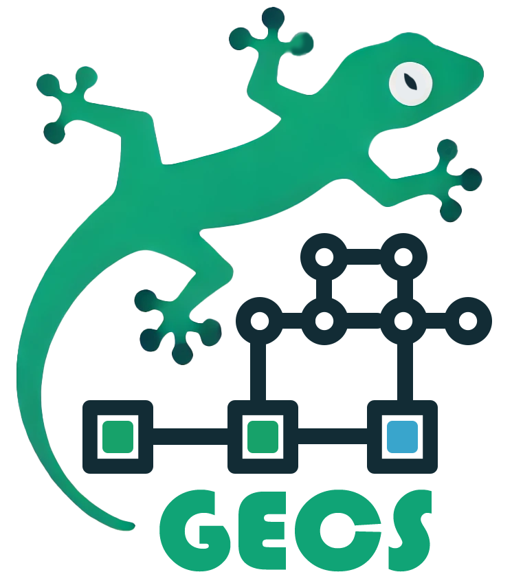

# GECS
> Godot Entity Component System

A lightweight, performant ECS framework for Godot 4.x that integrates seamlessly with Godot's node system.

## Features

- 🎯 Full integration with Godot's node system
- 🚀 Query-based entity filtering with optimized component indexing
- 🔧 System groups for organized processing
- 📦 Component resources that work in the editor
- 🎮 Easy setup with automatic node management
- 🕹️ Full Example game Zombies Ate My Neighbors and a 2D Breakout Clone being made with system

## Table of Contents

1. [Introduction](#introduction)
2. [Installation](#installation)
3. [Getting Started](#getting-started)
   - [Basic Concepts](#basic-concepts)
4. [Creating Components](#creating-components)
5. [Creating Entities](#creating-entities)
6. [Creating Systems](#creating-systems)
7. [The World and ECS Singleton](#the-world-and-ecs-singleton)
8. [Example Project](#example-project)
   - [Components](#components)
   - [Entities](#entities)
   - [Systems](#systems)
9. [Advanced Usage](#advanced-usage)
   - [Querying Entities](#querying-entities)
10. [Conclusion](#conclusion)

## Introduction

GECS is an Entity Component System (ECS) framework designed for the Godot Engine. It provides a simple yet powerful way to organize your game logic using the ECS pattern, allowing for better code organization, reusability, and scalability.

This documentation will guide you through the setup and usage of the GECS addon, providing examples from a sample game project to illustrate key concepts.

## Installation

1. **Download the Addon**: Clone or download the GECS addon and place it in your project's `addons` folder.

2. **Enable the Addon**: In the Godot editor, go to `Project > Project Settings > Plugins`, and enable the `GECS` plugin.

3. **Autoload ECS**: The addon requires the `ECS` singleton to be autoloaded. This should be handled automatically when you enable the plugin. If not, go to `Project > Project Settings > Autoload`, and add `ECS` pointing to `res://addons/gecs/ecs.gd`.


## Getting Started

### Basic Concepts

> Each class has a full set of in-editor Godot documentation. Check there as well!

Before diving into the usage of the GECS addon, it's important to understand the basic concepts of an Entity Component System (ECS):

- **Entity**: A container or placeholder that represents an object in your game. Entities can have multiple components added to them to define their behavior and properties.

- **Component**: A data container that holds specific attributes or properties. Components do not contain game logic.

- **Archetypes**: A specific named Entity that has a specific set of components (at ready) and usually is using script inheritance to take advantage of any godot nodes features. OR... just a named Entity. Very handy for relationship queries.

- **System**: A system contains two parts. The query which defines which entities to operate on and the logic that operates on each entity with specific components.

- **World**: The context in which entities and systems exist and interact.

- **World Query**: A way to query for specific entities in the world based on the components they contain or the relationships they have. 

_ **Component Query** In A world query we can define how the components property values should match specific criteria. Allowing us to further refine world queries beyond just presence of components. See more: [Component_Queries.md](./COMPONENT_QUERIES.md)

- **Relationship**: A resource that represents a relationship between a target and a source based on a relation. See more: [Relations.md](./RELATIONSHIPS.md)

- **ECS Singleton**: Provides global access to the current `World` instance and offers utility functions for processing.


## Creating Components

Components in GECS are resources that extend the `Component` class. They are simple data containers without any logic. They may contain functions but only for getting/setting properties on the component. 

Here's how to create a new component:

1. **Create a New Script**: Create a new script extending `Component`.

```gdscript
# c_bounce.gd
class_name CBounce
extends Component

@export var normal := Vector2.ZERO
@export var should_bounce := false
```

2. **Define Properties**: Add any properties that represent the data for this component. Use the `@export` keyword to make them editable in the inspector. This allows you to use them in the godot editor to design entities with components and modify those properties. 

## Creating Entities

Entities in GECS are nodes that extend the `Entity` class. They can have components added to them to define their behavior.

1. **Create a New Scene**: Create a new scene with a root node extending `Entity`.

2. **Add Components**: Use the `component_resources` exported array to add instances of your components.

```gdscript
# e_ball.gd
class_name Ball
extends Entity

func on_ready() -> void:
    Utils.sync_transform(self)
```

3. **Initialize Components**: In the `_ready()` function, components listed in `component_resources` are automatically added to the entity but you can also override a method called `define_components()` and return an array of components. 

## Creating Systems

Systems in GECS are nodes that extend the `System` class. They contain the logic that operates on entities with specific components.

1. **Create a New Script**: Create a new script extending `System`.

```gdscript
# s_bounce.gd
class_name BounceSystem
extends System

func query():
  # All entities that all have transform, velocity and bounce components
    return q.with_all([CTransform, CVelocity, CBounce])

func process(entity: Entity, delta: float):
    var c_bounce: CBounce = entity.get_component(CBounce)
    if c_bounce.should_bounce:
        var c_velocity: CVelocity = entity.get_component(CVelocity)
        c_velocity.direction = c_bounce.normal
        c_bounce.should_bounce = false
```

2. **Override the `query()` Function**: In the `query()` function, specify the components that entities must have for the system to process them. Use the provided `q` (QueryBuilder) to build the query.

3. **Implement the `process()` Function**: The `process()` function contains the logic to be applied to each relevant entity. It is called for each entity that matches the query.

## The World and ECS Singleton

The `World` class manages all entities and systems in your game. It processes systems and handles entity queries.

- **ECS**: A singleton autoloaded to provide access to the current `World`.

- **Setting Up the World**: In your main scene, add a node extending `World` and add your entities and systems as children.

_ **Executing the systems in the world**: Make sure to call ECS.process(delta, group) to run your systems. To process all active systems regardless of their group, omit the `group` parameter

```gdscript
# main.gd
extends Node

@onready var world: World = $World

func _ready() -> void:
    ECS.world = world

func _process(delta):
    # Process only systems in the "gameplay" group
    ECS.process(delta, "gameplay")

func _physics_process(delta):
    # Process only systems in the "physics" group
    ECS.process(delta, "physics")
```

## Example Project
> ALSO Check out the example games being made on the branch [zombies-ate-my-neighbors](https://github.com/csprance/gecs/tree/zombies-ate-my-neighbors/game) and [breakout](https://github.com/csprance/gecs/tree/breakout/game)

To illustrate the usage of GECS, let's look at an example project that simulates a simple Breakout game.

### Components

- **Bounce**: Indicates that an entity can bounce off surfaces.

```gdscript
# c_bounce.gd
class_name CBounce
extends Component

@export var normal := Vector2.ZERO
@export var should_bounce := false
```

- **Velocity**: Controls the movement speed and direction of an entity.

```gdscript
# c_velocity.gd
class_name CVelocity
extends Component

@export var direction := Vector2.ZERO
@export var speed := 0.0
```

- **Transform**: Manages the position, rotation, and scale of an entity.

```gdscript
# c_transform.gd
class_name CTransform
extends Component

@export var transform: Transform2D
```

### Entities

- **Ball**: Represents the ball in the game.

```gdscript
# e_ball.gd
class_name Ball
extends Entity

func on_ready() -> void:
    Utils.sync_transform(self)
```

In the scene, the `Ball` entity includes `Bounce`, `Velocity`, and `Transform` components.

- **Paddle**: Represents the player's paddle.

```gdscript
# e_paddle.gd
class_name Paddle
extends Entity

func on_ready() -> void:
    Utils.sync_transform(self)
```

Includes `CPlayerMovement`, `CVelocity`, `CTransform`, and `CFriction` components.

### Systems

- **BounceSystem**: Handles the bouncing logic of entities.

```gdscript
# s_bounce.gd
class_name BounceSystem
extends System

func query():
    return q.with_all([CTransform, CVelocity, CBounce])

func process(entity: Entity, delta: float):
    var c_bounce: CBounce = entity.get_component(CBounce)
    if c_bounce.should_bounce:
        var c_velocity: CVelocity = entity.get_component(CVelocity)
        c_velocity.direction = c_bounce.normal
        c_bounce.should_bounce = false
```

- **VelocitySystem**: Updates entity positions based on their velocity.

```gdscript
# s_velocity.gd
class_name VelocitySystem
extends System

func query():
    return q.with_all([CVelocity, CTransform])

func process(entity: Entity, delta: float):
    var c_velocity: CVelocity = entity.get_component(CVelocity)
    var c_transform: CTransform = entity.get_component(CTransform)
    var velocity_vector: Vector2 = c_velocity.direction.normalized() * c_velocity.speed
    c_transform.transform.origin += velocity_vector * delta
```

- **Transform2DSystem**: Synchronizes the `Transform` component with the entity's actual transform.

```gdscript
# s_transform_2d.gd
class_name Transform2DSystem
extends System

func query():
    return q.with_all([CTransform])

func process(entity: Entity, delta):
    Utils.sync_transform(entity)
```

## Advanced Usage

### Querying Entities

The `QueryBuilder` class provides an advanced query function to retrieve entities based on their components.
In classes extending System it is exposed in the `q` variable
```gdscript
q
  .with_all([]) # Find entities that have all these components
  .with_any([]) # Find entities that have any of these components
  .with_none([]) # Exclude entities that have these components
  .with_relationship([]) # Must have these relationships
  .without_relationship([]) # must not  these relationships
  .with_reverse_relationship([]) # must have these reverse relationships
```

- **with_all**: Entities must have all of these components.
- **with_any**: Entities must have at least one of these components.
- **with_none**: Entities must not have any of these components.
- **with_relationship**: Entities must have these relationships
- **without_relationship**: Entities must not have these relationships
- **with_reverse_relationship**: This finds the entities of reverse relationships (aka the target of the relationship, not the source)

**Example**:

```gdscript
var entities_with_velocity_and_not_captured = q.with_all([CVelocity]).with_none([CCaptured])
```

Systems have properties that allow for customizing their execution:

* active: Determines whether the system runs during processing. If false, the system will be skipped.
* group: Assigns the system to a specific group. This allows you to control the execution of systems in groups. You can process systems of a specific group by providing the group name to the ECS.process(delta, group) function.

Example:
```gdscript
func _physics_process(delta):
    ECS.process(delta, "physics")

func _process(delta):
    ECS.process(delta, "gameplay")
```
This will only process systems that are in the "physics" group in the physics process function and gameplay system in the _process function

To process all active systems regardless of their group, omit the `group` parameter:

### Processing Systems by Group

Systems can be assigned to specific groups, enabling you to control when and how they are processed. This is particularly useful for separating logic that should run at different times or frequencies.

**Assigning Systems to Groups**:

In your system script, set the `group` property to specify which group the system belongs to.

## Conclusion

The GECS addon provides a flexible and efficient way to implement the ECS pattern in your Godot projects. By separating data (components) from logic (systems), you can create reusable and maintainable game code.

Feel free to explore and expand upon the example project provided, and refer to this documentation and especially the in editor documentation as you integrate GECS into your own games.

## TODO:
- Build a better GUI for seeing Systems and their groups
- GUI For Seeing all Systems executing
- Gui for seeing all Entities and Components and Values in those components
- GUI TO see all Components by type